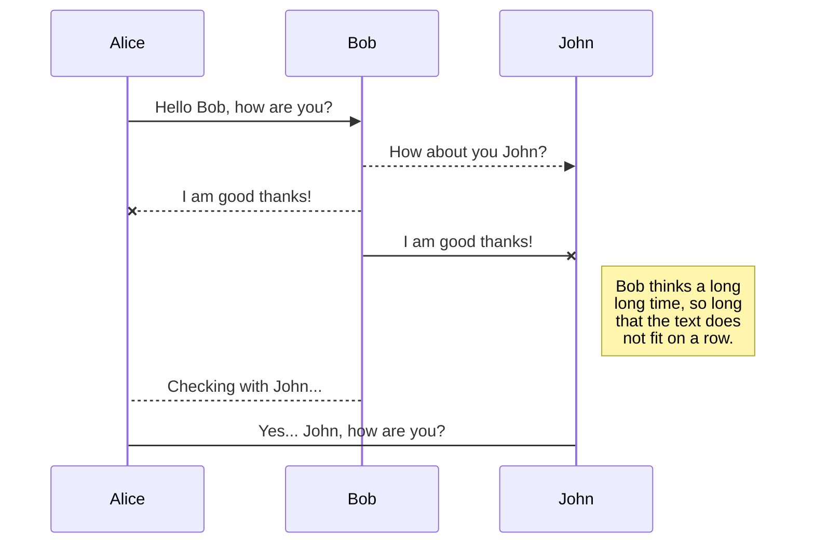
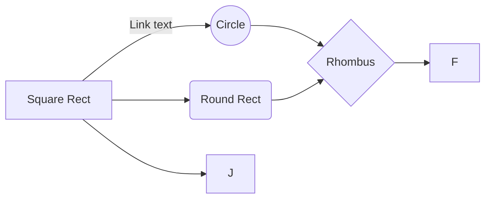

# 같이의 가치를 아는 개발자,  노현욱입니다.
## About Me
### Introduction
-   안녕하세요! 개발자 지망생(?) 노현욱입니다.
-   현재 컴퓨터 공학과 3학년 재학중입니다.
-   읽기 쉬운, 설명 가능한, 코드를 작성하기 위해 노력하고 있습니다.
-   함께 할때 더 빠르게 성장할 수 있음을 깨달은 이후, 같이 성장하는 사람이 될 수 있도록 노력하고 있습니다.

### Contact & Channel
- Email : rohsik2@gmail.com
- Github : https://github.com/rohsik2
- Blog : https://rohsik2.github.io

## Skills

### Backend
- Python, Django
- Git

### Frontend

-   HTML5, CSS3(SCSS), JS(ES6)

## Experiences
- 대학교내 SW 봉사단 2년 진행
-- 초, 중학생 대상 AR, VR 체험 행사 진행 및 Python 기초 코딩 강의
- 고등학교 방과후 실급교사 2년 진행
-- JAVA이용 객체지향 프로그래밍, 알고리즘 실습 수업 진행
- CIT 코딩학원 강사 6개월
-- Python, Arduino, Scratch, IOT 등등 청소년 대상 수업 진행

> Table View

|                |ASCII                          |HTML                         |
|----------------|-------------------------------|-----------------------------|
|Single backticks|`'Isn't this fun?'`            |'Isn't this fun?'            |
|Quotes          |`"Isn't this fun?"`            |"Isn't this fun?"            |
|Dashes          |`-- is en-dash, --- is em-dash`|-- is en-dash, --- is em-dash|

## KaTeX

You can render LaTeX mathematical expressions using [KaTeX](https://khan.github.io/KaTeX/):

The *Gamma function* satisfying $\Gamma(n) = (n-1)!\quad\forall n\in\mathbb N$ is via the Euler integral

$$
\Gamma(z) = \int_0^\infty t^{z-1}e^{-t}dt\,.
$$

> You can find more information about **LaTeX** mathematical expressions [here](http://meta.math.stackexchange.com/questions/5020/mathjax-basic-tutorial-and-quick-reference).

## UML diagrams

You can render UML diagrams using [Mermaid](https://mermaidjs.github.io/). For example, this will produce a sequence diagram:

And this will produce a flow chart:

